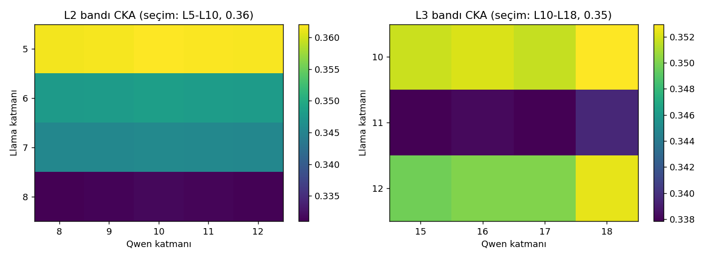
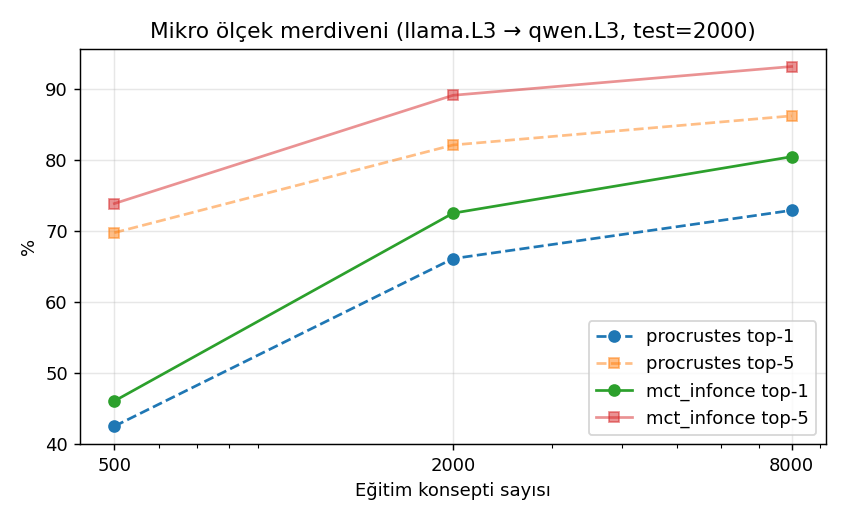
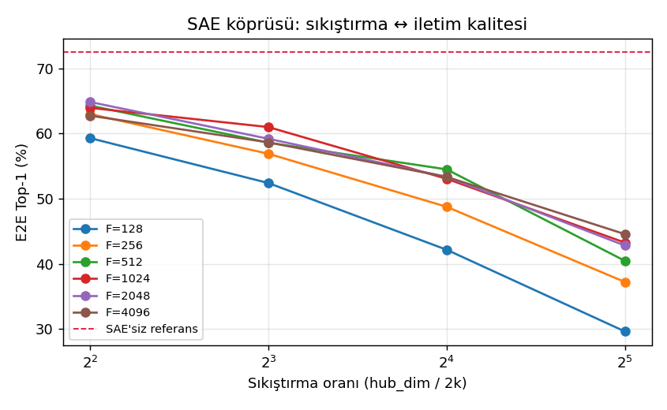

# Unified Cognitive Mesh v2 — FAZ 1-2 Deney Raporu

Modeller: **Llama-3.2-1B** (16 katman, d=2048) ↔ **Qwen2.5-0.5B** (24 katman, d=896); 10.000 konsept (8.000 EN + 2.000 TR, wordfreq frekans sıralı); eğitim/test = 8.000/2.000; havuz = 10.000 (zor koşul). Donanım: Apple Silicon MPS, fp16 çıkarım.

## 1. CKA katman taraması

- **Katman-2 (işlem-süreci, %30-50):** llama L5 ↔ qwen L10 (CKA=0.362)
- **Katman-3 (anlamsal, %60-75):** llama L10 ↔ qwen L18 (CKA=0.353)
- Model-içi L2→L3 CKA: llama 0.818, qwen 0.999

## 2. MCT yöntem karşılaştırması (n_train=8000, llama.L3→qwen.L3)

| Yöntem | Cosine | Top-1 | Top-5 | Top-20 | Geometri ρ |
|---|---|---|---|---|---|
| procrustes | 0.500 | 72.9% | 86.2% | 90.7% | 0.995 |
| ridge | 0.739 | 61.9% | 75.5% | 81.9% | 0.476 |
| mct_cos | 0.679 | 71.5% | 82.0% | 85.2% | 0.669 |
| mct_infonce | 0.510 | 80.5% | 93.2% | 96.7% | 0.636 |

### Mikro ölçek merdiveni

| n_train | Yöntem | Cosine | Top-1 | Top-5 | Geometri ρ |
|---|---|---|---|---|---|
| 500 | procrustes | 0.407 | 42.5% | 69.8% | 0.964 |
| 500 | mct_infonce | 0.389 | 46.1% | 73.9% | 0.859 |
| 2000 | procrustes | 0.465 | 66.1% | 82.1% | 0.986 |
| 2000 | mct_infonce | 0.446 | 72.5% | 89.1% | 0.723 |
| 8000 | procrustes | 0.500 | 72.9% | 86.2% | 0.995 |
| 8000 | mct_infonce | 0.510 | 80.5% | 93.2% | 0.636 |

## 3. Anlamsal uzay denemeleri

- **EN** (n=1597): top-1 89.1%, top-5 98.6%, cos 0.539
- **TR** (n=403): top-1 46.2%, top-5 71.7%, cos 0.392
- k-NN tutarlılığı (Jaccard@10): 0.217
- Analoji (çevrilmiş): top-1 16.7%, top-5 33.3% (n=12); yerli B-uzayı referansı top-1 0.0%

Niteliksel komşuluklar (çevrilen vektör → qwen uzayı):

- `economy` → ['economy', 'economics', 'markets', 'agriculture', 'education']
- `müzik` → ['müzik', 'music', 'şarkı', 'sınav', 'satış']
- `doctor` → ['doctor', 'surgeon', 'doctors', 'hospital', 'nurse']
- `bilim` → ['bilim', 'bilmem', 'bilir', 'bilmek', 'bilen']
- `happy` → ['happy', 'happier', 'glad', 'sad', 'delighted']

## 4. Nötr ortak uzay (hub-and-spoke, ortak eğitim)

Hub boyutu: 512; 4 spoke × (encoder+decoder) = 8 MCT, tek ortak eğitim; hiçbir çift için ayrı tercüman yok.

| Yön | Top-1 | Top-5 | Cosine |
|---|---|---|---|
| llama_L2->llama_L3 | 99.3% | 100.0% | 0.693 |
| llama_L2->qwen_L2 | 73.9% | 84.2% | 0.718 |
| llama_L2->qwen_L3 | 71.4% | 81.8% | 0.710 |
| llama_L3->llama_L2 | 99.5% | 100.0% | 0.652 |
| llama_L3->qwen_L2 | 74.5% | 85.9% | 0.728 |
| llama_L3->qwen_L3 | 72.5% | 84.2% | 0.720 |
| qwen_L2->llama_L2 | 80.0% | 90.3% | 0.509 |
| qwen_L2->llama_L3 | 83.8% | 92.5% | 0.563 |
| qwen_L2->qwen_L3 | 99.4% | 100.0% | 0.960 |
| qwen_L3->llama_L2 | 79.9% | 90.1% | 0.506 |
| qwen_L3->llama_L3 | 83.0% | 92.6% | 0.561 |
| qwen_L3->qwen_L2 | 99.9% | 100.0% | 0.967 |

## 5. Derinlik çevirisi (H5)

| Yol | Cosine | Top-1 |
|---|---|---|
| llama_L2->qwen_L3 | 0.710 | 71.4% |
| qwen_L2->llama_L3 | 0.563 | 83.8% |
| llama_L2->llama_L3 | 0.693 | 99.3% |
| qwen_L2->qwen_L3 | 0.960 | 99.4% |
| llama_L3->qwen_L3 | 0.720 | 72.5% |
| baseline_procrustes_llama_L2->qwen_L3 | 0.482 | 75.0% |
| baseline_procrustes_llama_L2->llama_L3 | 0.638 | 99.6% |

**H5 (llama.L2→hub→qwen.L3 ≥ 0.75 cos): KALDI ❌**

## 6. SAE köprüsü (H4)

| F | k | Oran | Recon cos | E2E Top-1 | E2E Top-5 |
|---|---|---|---|---|---|
| 128 | 8 | 32x | 0.706 | 29.6% | 48.5% |
| 128 | 16 | 16x | 0.754 | 42.1% | 60.1% |
| 128 | 32 | 8x | 0.796 | 52.4% | 69.2% |
| 128 | 64 | 4x | 0.833 | 59.3% | 73.7% |
| 256 | 8 | 32x | 0.739 | 37.2% | 58.9% |
| 256 | 16 | 16x | 0.789 | 48.8% | 67.8% |
| 256 | 32 | 8x | 0.827 | 56.9% | 73.0% |
| 256 | 64 | 4x | 0.865 | 63.0% | 76.2% |
| 512 | 8 | 32x | 0.757 | 40.5% | 63.4% |
| 512 | 16 | 16x | 0.804 | 54.5% | 71.4% |
| 512 | 32 | 8x | 0.840 | 58.6% | 74.8% |
| 512 | 64 | 4x | 0.877 | 64.3% | 79.0% |
| 1024 | 8 | 32x | 0.768 | 43.2% | 66.8% |
| 1024 | 16 | 16x | 0.813 | 53.0% | 72.5% |
| 1024 | 32 | 8x | 0.846 | 61.0% | 76.5% |
| 1024 | 64 | 4x | 0.878 | 63.9% | 78.6% |
| 2048 | 8 | 32x | 0.773 | 42.8% | 66.6% |
| 2048 | 16 | 16x | 0.814 | 53.3% | 74.2% |
| 2048 | 32 | 8x | 0.848 | 59.2% | 77.3% |
| 2048 | 64 | 4x | 0.878 | 64.8% | 79.5% |
| 4096 | 8 | 32x | 0.776 | 44.5% | 67.7% |
| 4096 | 16 | 16x | 0.815 | 53.3% | 75.3% |
| 4096 | 32 | 8x | 0.846 | 58.7% | 77.3% |
| 4096 | 64 | 4x | 0.877 | 62.7% | 79.5% |

SAE'siz referans: top-1 72.5%

**H4 (≥8x sıkıştırmada ≤5 puan): en iyi F=1024, k=32 @ 8x, düşüş 11.5 puan → KALDI ❌**

## 7. Activation patching (H3)

- KL(MCT ‖ temiz) = 3.013
- KL(rastgele ‖ temiz) = 4.059
- KL oranı = 0.742 (eşik < 0.2)
- Top-1 next-token uyumu: MCT 26.5% (eşik > %60), rastgele 17.0%

**H3: KALDI ❌**
